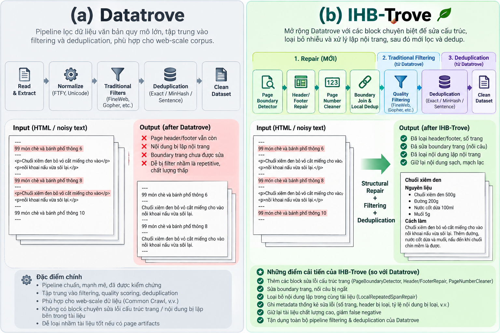
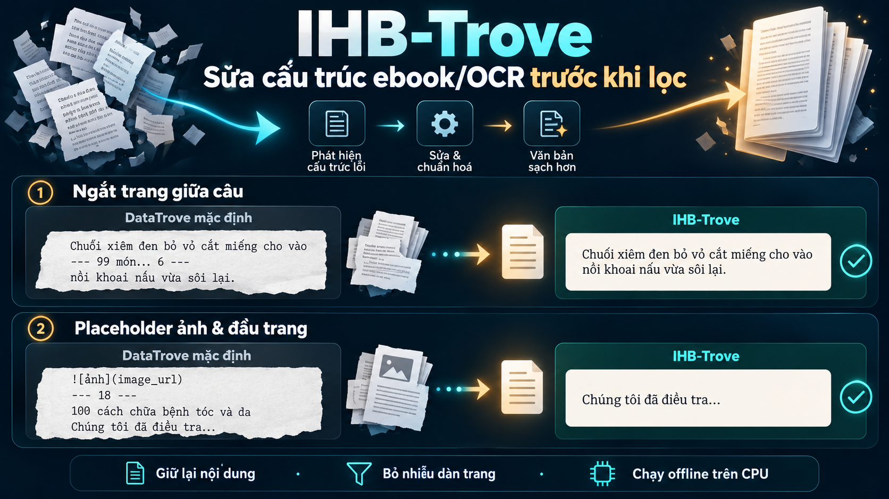

# IHB-Trove

Deterministic structural repair **before** conventional DataTrove filtering and deduplication for ebook, OCR, and HTML-to-text corpora. The extension uses DataTrove `PipelineStep`, `BaseFilter`, `JsonlReader`/`JsonlWriter`, `LocalPipelineExecutor`, ExactDedup, SentenceDedup, and MinHash. It runs on CPU without LLMs or embeddings.



## Before and after on supplied books



The left panels illustrate a **DataTrove reader/writer pass-through** without a repair step; DataTrove has no default filtering pipeline that guarantees a particular output. The right panels show structural changes verified on supplied ebook JSONL files. The image shortens surrounding text for legibility. It does not claim to verify factual content or recover missing OCR text. The current default keeps documents regardless of how many characters repair removes and records those metrics for review.

## Portable bundled DataTrove

This repository includes the `datatrove/` Python package and assets from the user's original `datatrove.zip` (SHA-256 `e16e9fcd796d56a8edcfebe2333073a0fae16039a03bdc7a7fce224055e63fac`). The archive is a modified DataTrove snapshot, **not** a stock PyPI wheel; its bytecode and notebook checkpoints are excluded. A single `pip install -e .` installs both `ihb_trove` and `datatrove` imports, with no separate `pip install datatrove` required. Keep this environment separate from an existing DataTrove installation because the two distributions expose the same import name.

The supplied snapshot pointed FT176 to `/workspace/storage-shared/nlp/maitn4/code/data-processing/utils/lid.176.bin` and the public suffix list to `/workspace/storage-shared/nlp/maitn4/code/data-processing/utils/public_suffix_list.dat`. These locations remain preferred if the files exist. Override them with `IHB_TROVE_FT176_MODEL` and `IHB_TROVE_PUBLIC_SUFFIX_LIST`. Otherwise FT176 falls back to the official fastText download URL/cache, and URLFilter uses tldextract's bundled suffix snapshot without a network fetch. **Model weights are not included.** The default IHB-Trove path does not run a language detector. For FT176 install `pip install -e '.[ft176]'`; for URLFilter install `pip install -e '.[url-filter]'`.

The DataTrove sources are redistributed under [Apache License 2.0](DATATROVE_LICENSE). IHB-specific changes to bundled sources are marked in comments or visible in the diffs, including the optional no-tokenizer path in Gopher for mixed-language character-only checks. The original DataTrove project is [huggingface/datatrove](https://github.com/huggingface/datatrove).

## Folder in → `survive/` and `eliminated/` out

Requires Python 3.11+. The default path keeps every language and uses an offline Unicode tokenizer for deduplication; it does not download language models.

```bash
python -m venv .venv
.venv/bin/python -m pip install -e .
.venv/bin/ihb-trove /path/to/input_jsonl_folder /path/to/new_output_folder
```

Pass multiple input folders before the output folder to process their JSONL files in one shared pipeline and deduplicate across all of them:

```bash
.venv/bin/ihb-trove /path/to/raw-book /path/to/raw-giaoduc /path/to/new_output_folder
```

For long folder lists, `--input-folders-file` reads one folder path per line. Blank lines and lines beginning with `#` are ignored; relative paths are resolved against the list file's directory:

```bash
.venv/bin/ihb-trove /path/to/new_output_folder --input-folders-file /path/to/input_folders.txt
```

If a run is interrupted, resume it with the same input, output, and pipeline options:

```bash
.venv/bin/ihb-trove /path/to/input_jsonl_folder /path/to/new_output_folder --resume
```

The runner checkpoints completed stages under `OUTPUT/.ihb_trove_cache/`. The cache is retained after interruption and removed after a successful run. A resumed run reuses completed stages and reruns only the unfinished stage; if interrupted during final routing, it rebuilds `survive/` and `eliminated/` from cached stage outputs. Input content and pipeline options must match the checkpoint. Resume re-reads the input to verify its content fingerprint. Legacy interrupted runs that only have an `ihb-trove-*` temporary directory cannot be resumed by this feature.

By default, the CLI detects the available CPU quota, uses up to 32 workers and creates up to four DataTrove shards per worker, capped by the number of JSONL files. Task count is always capped by the file count because this runner shards its reader by file. Input validation/staging reads up to 16 files concurrently. ExactDedup and SentenceDedup use up to 16 hash-range finder workers by default; set `--dedup-finder-workers` to tune that phase. Pass `--tasks` and `--workers` to override the main executor defaults. Set `--workers 1` for a serial baseline. Progress bars report staged files, DataTrove reader file shards, and records being routed; bars are disabled automatically when output is not an interactive terminal.

The run writes a live orchestration log to `OUTPUT/logs/run.log`; DataTrove executor/task logs remain under `OUTPUT/logs/datatrove/` after completion. Follow the live log in another terminal with:

```bash
tail -f /path/to/new_output_folder/logs/run.log
```

To confirm both import names resolve to this checkout:

```bash
.venv/bin/python -c "import datatrove, ihb_trove; print(datatrove.__file__, ihb_trove.__file__)"
```

The script scans `*.jsonl` **recursively** under every input folder, processes all documents together for global deduplication, and mirrors each input file's relative path under both outputs. With multiple input folders, each path is prefixed by its source folder name to prevent collisions. Each source has a corresponding JSONL file in each output, possibly empty. Every input record goes to exactly one side. Invalid JSON and records without text go to `eliminated/` with a reason; filtering and whole-document dedup removals also go there. SentenceDedup edits a surviving document's text without routing its original copy to `eliminated/`.

```text
input_jsonl_folder/
  book_a.jsonl
  collection/book_b.jsonl

new_output_folder/
  survive/book_a.jsonl
  survive/collection/book_b.jsonl
  eliminated/book_a.jsonl
  eliminated/collection/book_b.jsonl
  .ihb_trove_cache/              # retained only while a run is incomplete
  summary.json
```

Every eliminated record carries `metadata.filter_reason` and `metadata.ihb_exclusion_stage`; records retain their source file and one-based source line in metadata. The CLI refuses a nonempty output folder and rejects overlapping input/output directories. Intermediate DataTrove signatures live in a temporary work directory and are removed after a successful run; persistent run and executor logs stay under `output/logs/`.

```bash
# If the corpus is mixed media and real image references should be retained:
.venv/bin/ihb-trove INPUT OUTPUT --keep-image-placeholders

# Custom page marker in addition to form feed (repeat the option for multiple markers):
.venv/bin/ihb-trove INPUT OUTPUT --page-marker='[PAGE]'

# Optional: join visible hyphenated line breaks (review output for altered words/names):
.venv/bin/ihb-trove INPUT OUTPUT --dehyphenate-line-breaks

# Optional: use a DataTrove locale tokenizer for SentenceDedup/MinHash instead of UnicodeTokenizer:
.venv/bin/ihb-trove INPUT OUTPUT --dedup-tokenizer-language en
```

For a large corpus, the ExactDedup and SentenceDedup hash-finder phases can run in parallel. The default is `min(16, tasks, workers)`; raise it cautiously because each hash partition creates intermediate signature files:

```bash
.venv/bin/ihb-trove INPUT OUTPUT --tasks 448 --workers 112 --dedup-finder-workers 16
```

There is no language filter and no maximum repair-fraction gate: `RepairMetrics` records the edit counts and confidence for review, while the repaired document continues through the pipeline. Markdown/HTML image references and generated unavailable-image notes are removed by default. `--skip-long-line-loops` disables the conservative exact OCR word-loop repair. The Unicode normalization step expands common presentation ligatures, removes soft hyphens, trims line-end spaces, and caps blank-line runs at two; use `--max-consecutive-blank-lines` to change the cap. Visible-hyphen line joining is opt-in because it can alter legitimate words and names.

## Processing order

1. `UnicodeNormalizer` (Unicode/ligature normalization, soft-hyphen removal, whitespace cleanup; optional visible-hyphen joining) → `ImagePlaceholderRepair` → `PageStructureRepair` → `LocalRepeatedSpanRepair` → `LongLineLoopRepair` → `RepairMetrics`.
2. `GopherRepetitionFilter` with only permissive, language-neutral duplicate-character checks → `BookQualityFilter` (empty text and extreme repeated long lines only).
3. Separate DataTrove jobs: **ExactDedup → SentenceDedup → MinHash**. A disk-backed routing pass compares stage outputs by a stable source-record ID so every dropped document receives a reason, including whole-document dedup drops.

`PageStructureRepair` recognizes `---`, form feed, and configured markers. It learns recurring edge lines with normalized signatures and RapidFuzz OCR clustering; stable numeric titles can be headers, while changing recipe numbers are preserved. Page numbers require a consistent offset, including contiguous offset changes. `LocalRepeatedSpanRepair` verifies rolling-hash hits on nearby long multiline spans. `LongLineLoopRepair` keeps one copy of a substantial word span repeated at least four times within a long line. Short repeated headings such as `Nguyên liệu` remain content. All repair counters, before/after lengths, removed fraction, confidence, and version are written to `document.metadata["repair"]`.

The default keeps every language. Gopher's duplicate-line and duplicate-paragraph count checks and locale-sensitive word n-grams are disabled; duplicate-character checks are set to 50% so short headings and structured prose do not reject a whole document. `BookQualityFilter` has no default minimum word count or alphabetic fraction and rejects only empty text or extreme repetition of long lines. SentenceDedup and MinHash use `UnicodeTokenizer`, a deterministic offline tokenizer with Unicode letter/number runs and grapheme shingles for scripts commonly written without spaces. Grapheme shingles are a language-neutral approximation, not linguistic word segmentation. `--dedup-tokenizer-language` is an optional override for a known single-language corpus.

## Validation

```bash
.venv/bin/python -m pytest -q
```

The sample fixes remain covered by repair fixtures: recurring page furniture, OCR variants, page numbers, page-boundary sentence joins, repeated OCR spans, and image placeholders. A document is no longer eliminated just because a large fraction was repaired; review `metadata.repair` for `removed_fraction` and `repair_confidence` if you need a separate human-review policy. These structural checks do not verify factual correctness or recover missing OCR text.

The per-document repair steps hold a document in memory. For very large books, split the input into chapters or volumes with intact page markers. Global dedup quality cannot be estimated from only three different books. Existing table-of-contents and publisher back matter are intentionally left for a separate corpus policy.
